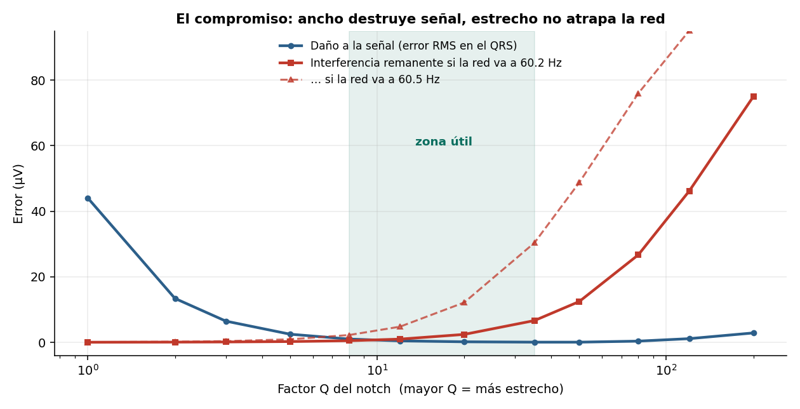
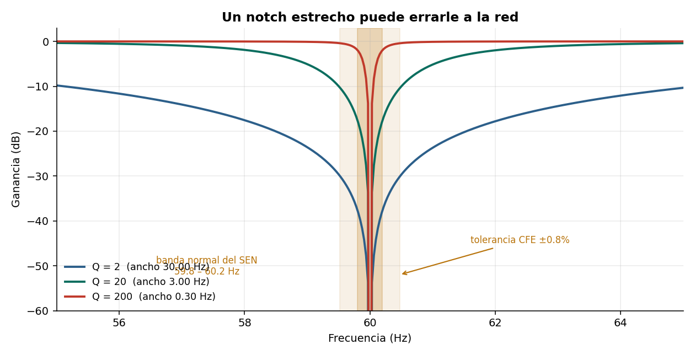

# Matar los 60 Hz sin dañar el QRS

El filtro notch tiene dos modos de fallo opuestos. Este repositorio los mide sobre una
señal de referencia conocida y localiza el rango útil del factor Q.



## Resultado principal

Las dos curvas se cruzan. Por debajo de Q ≈ 8 domina el daño al complejo QRS; por encima
de Q ≈ 35, el fallo de rechazo cuando la red se desvía de 60.00 Hz. **Entre 10 y 30 ambos
errores quedan por debajo de 5 µV.**

### Notch demasiado ancho

| Q | Ancho | Error en el QRS |
|---|---|---|
| 1 | 60.00 Hz | 44.0 µV |
| 5 | 12.00 Hz | 2.5 µV |
| 20 | 3.00 Hz | 0.2 µV |

Con Q = 1 el error se concentra en el QRS, con picos de 200 µV y una pérdida del **16% en
la amplitud de la onda R**. El QRS es un evento de banda ancha: parte de su energía está
en 60 Hz, y un notch ancho no la distingue de la interferencia.

### Notch demasiado estrecho

La frecuencia de red fluctúa. En México el Sistema Eléctrico Nacional opera entre 59.8 y
60.2 Hz en condiciones normales, con tolerancia CFE de ±0.8% (hasta ±0.48 Hz). Un notch de
Q = 200 tiene 0.3 Hz de ancho y no cubre ni la banda normal.

Interferencia remanente, sobre 120 µV originales:

| Q | +0.0 Hz | +0.2 Hz | +0.5 Hz |
|---|---|---|---|
| 5 | 0.1 | 0.2 | 0.9 |
| 20 | 0.4 | 2.4 | 12.2 |
| 200 | 3.2 | 75.0 | **109.4** |

Este modo de fallo es silencioso: el código no da error y la señal sigue sucia.



## Armónicos

| Método | Error en el QRS |
|---|---|
| Sin filtrar | 89.2 µV |
| Notch solo en 60 Hz | 27.3 µV |
| Cascada 60/120/180 (Q=20) | **0.2 µV** |
| Paso-bajo a 40 Hz | 14.0 µV |

El paso-bajo elimina los armónicos pero introduce setenta veces más error que la cascada,
porque recorta contenido legítimo del QRS por encima de 40 Hz.

Nota sobre `scipy.signal.iircomb`: exige que la frecuencia de muestreo sea múltiplo entero
de la frecuencia a eliminar. Con fs = 500 Hz y f₀ = 60 Hz no es aplicable.

## Función resultante

```python
def quitar_red(x, fs, f_red=60.0, Q=20, n_armonicos=3):
    """f_red: 60.0 en América, 50.0 en Europa y buena parte de Asia."""
    for k in range(1, n_armonicos + 1):
        f0 = f_red * k
        if f0 >= fs/2:
            break
        b, a = sg.iirnotch(f0, Q, fs=fs)
        x = sg.filtfilt(b, a, x)
    return x
```

## Contenido

```
notebooks/notch_60hz.ipynb   Notebook completo, ejecutable de principio a fin
src/ecglib.py                Generador de ECG y modelos de ruido
figuras/                     Figuras generadas
```

## Reproducir

```bash
git clone https://github.com/USUARIO/ecg-notch-60hz.git
cd ecg-notch-60hz
pip install -r requirements.txt
jupyter lab notebooks/notch_60hz.ipynb
```

No requiere descargar datos: la señal se genera dentro del notebook.

## Limitaciones

El notch supone interferencia estacionaria. Si la frecuencia se desplaza durante el
registro, hacen falta filtros adaptativos (LMS con referencia de red) o métodos de
sustracción.

Q = 20 se deriva de la banda de fluctuación de la red mexicana. En instalaciones con
generador o inversor conviene medir la frecuencia real antes de fijar el filtro.

La interferencia de red es primariamente un problema de instalación: contacto de
electrodos, cables cortos y trenzados, y rechazo de modo común del amplificador. Filtrar
repara algo que no debió ocurrir.

## Referencias

- Kligfield P. et al. *Recommendations for the Standardization and Interpretation of the Electrocardiogram, Part I.* Circulation, 2007.
- Levkov C. et al. *Removal of power-line interference from the ECG: a review of the subtraction procedure.* BioMedical Engineering OnLine, 2005.
- CFE. *Guía L0000-70: Calidad de la energía — características y límites de las perturbaciones.*

## Licencia

MIT — ver [LICENSE](LICENSE).
